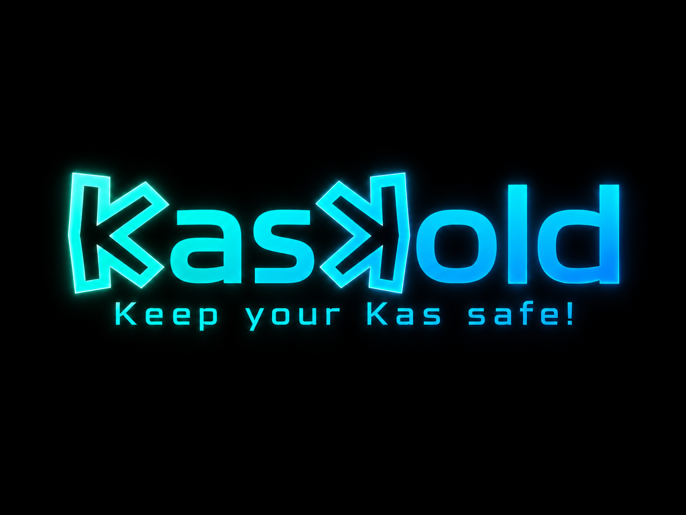

<!-- KasKold: Kaspa custody, signing, and companion wallet platform -->
<!-- Copyright (C) 2025-2026 KasSigner Project (kassigner@proton.me) -->
<!-- License: GPL-3.0-only -->

**Navigate:** [Documentation](docs/README.md) · [Building](docs/development/BUILDING.md) · [Companion](docs/companion/COMPANION.md) · [Security](SECURITY.md)

# KasKold

**Keep your KAS, safe!** Dedicated hardware, a KasKold Vault signer on Web/Android/iOS, and a strictly watch-only KasKold Companion on Web/Android/iOS.



KasKold keeps spending keys out of Companion entirely. Wallet creation, restoration, private-key custody, transaction review, and signing belong only to KasKold Hardware or a KasKold Vault app. Companion is always watch-only: it manages kpubs, observes network state, constructs transactions, presents signing requests to an external Vault/Hardware signer, accepts signed responses, and broadcasts finalized transactions. Hardware users can choose RAM-only **Always Start Fresh** operation or optional **device-bound encrypted wallet storage** protected by the ESP32-S3 HMAC eFuse service plus the user's PIN/password. Portable recovery remains the BIP39 mnemonic plus optional passphrase.

**KasKold product family:**

- **KasKold Hardware** — purpose-built CoreS3 offline signer that can create, restore, and sign wallets.
- **KasKold Vault Web** — browser software signer for create/restore/review/sign flows; it contains no blockchain node/watcher capability.
- **KasKold Vault Android / iOS** — dedicated signer apps for create/restore/review/sign flows; native Vault builds are network-isolated.
- **KasKold Companion Web / Android / iOS** — strictly watch-only apps. They manage kpubs, query balances/history, build transactions/covenants, display signing requests for Hardware/Vault, accept signed responses, and broadcast. They never create or restore wallets and never own private keys.

**Turn an old phone into an offline Kaspa signer instead of throwing it away.** If you later want purpose-built signing hardware, move to KasKold Hardware without changing the Companion workflow: the same protocol and transaction-review model is used with a different signer.

The firmware signing path is bare-metal `no_std` Rust. Companion uses the watch-only Rust/WASM `online-watcher` runtime with browser/native shells. Vault is a separate signer application family built around the shared Rust `vault-runtime`; it is not an offline switch or hidden custody mode inside Companion.

**Documentation:** [Overview](docs/README.md) · [Features](docs/features/FEATURES.md) · [Building](docs/development/BUILDING.md) · [Companion](docs/companion/COMPANION.md) · [Security](docs/security/SECURITY_OVERVIEW.md) · [Hardware](docs/hardware/HARDWARE.md)

## Features

- **Air-gapped signer** — QR/SD transaction exchange with on-device review; no wallet-network path in firmware.
- **Seed generation** — BIP39 12/24 words from mandatory health-checked hardware RNG + camera + board IMU + timing/context mixing, with optional additive dice; BIP32, BIP85, passphrases, and Touch Seed are supported. See [Entropy Sources](docs/security/ENTROPY_SOURCES.md).
- **Optionally stateless** — **Always Start Fresh** keeps key material in RAM and destroys it on power-off; encrypted device-bound persistence is opt-in.
- **Backups** — mnemonic/SeedQR, authenticated SD backups, and a **steganographic backup tool** that hides encrypted seeds inside ordinary JPEG photos.
- **Transactions** — Schnorr signing, PSKT/PSKB, session-bound KSPT v4, multisig, stealth, and current Covenants++ workflows.
- **Companions** — KasKold Companion Web plus Android and iOS shells around the same Rust/WASM wallet runtime.
- **Wallet integration SDK** — official network-free Rust crate/WASM SDK for third-party wallets to pair directly with KasKold; Companion is the reference consumer, not an intermediary.
- **Assurance** — reproducible builds, pinned toolchains, mutation/fuzz/coverage/CRAP gates, architecture checks, and explicit release evidence requirements.

See the [full feature summary](docs/features/FEATURES.md) and [CHANGELOG.md](CHANGELOG.md).

## Verify First: Reproducible Builds

Before flashing a release, rebuild it from source and compare the published hashes. The reproducible path uses the pinned Docker build rather than local compiler state.

```bash
make release
```

This builds and manifest-verifies the reproducible **normal release** artifacts. The normal release is deliberately non-destructive: it does not compile the Pop It!/owner-authority UI or boot-control provisioning path. Flash an already-built signed merged image with `make flash-release`; that target never rebuilds firmware, never invokes the secure-provisioning profile, and never falls back to an unsigned image. The two special CoreS3 provisioning builds are explicit and non-flashing: `make secure-provisioning SECURE_BOOT_KEY=... SIGNING_KEY=...` for vendor + optional owner authority, and `make secure-owner-only OWNER_KEY=...` for the restored sole-owner hardware trust model. Production publication additionally requires the external signed-evidence gate:

```bash
make release-readiness
```

See [Building](docs/development/BUILDING.md), [Reproducible Builds](docs/development/REPRODUCIBLE_BUILD.md), and [Release evidence](qa/release/README.md).

## Steganographic Backup: A beautiful way

KasKold can hide an encrypted mnemonic in an ordinary JPEG using authenticated **Descriptor** or **Picture** carriers, with device-bound or portable protection depending on the recovery goal.

See [Features](docs/features/FEATURES.md) and [JPEG Steganographic Backup](docs/security/STEGANOGRAPHY.md).

## Covenants++

Companion builds covenant transactions, KasKold reviews/signs them offline, and Companion broadcasts them. Current workflows cover savings/inheritance/limits, whitelists, channels, PayJoin, commit-reveal, Private Swap, KIP-20 vaults, Oracle, ZK Crowdfunding, ZK Price Oracle, and stealth payments.

`COVENANT SIGN` uses isolated covenant keys for exact reviewed commitments. See [Features](docs/features/FEATURES.md), [`COVENANT SIGN`](docs/protocol/COVENANT_SIGN.md), and the [Covenants & Stealth Guide](docs/guides/KasKold_Companion_Covenants_Stealth_Guide.pdf).

## Wallet Slot Types

KasKold supports up to 16 active wallet slots:

- **Mnemonic (12/24 words)** — full BIP39 wallet with HD addresses, BIP85, signing, kpub/XPrv, and SeedQR.
- **Account XPrv** — account-level extended private key with preserved derivation metadata.
- **Raw private key** — a single 32-byte secp256k1 scalar imported as 64 hex characters. **Compatible with KasWare-style raw-key exports.**

See [Features](docs/features/FEATURES.md) for recovery and compatibility details.

## Supported Hardware

| Target | Code support | Validation status |
|---|---|---|
| M5Stack CoreS3 | Yes | **Hardware-tested** |
| M5Stack CoreS3 Lite | Shared CoreS3 adapter/profile | **Build-supported; hardware qualification pending** |

Retired board ports are not shipped as supported targets. See [Hardware](docs/hardware/HARDWARE.md) for the current qualification policy.

## Building

GNU Make is the public developer interface on Linux, Windows, and macOS. Start with:

```bash
make help
make test
```

Use `make firmware` for a firmware build, `make companion` for Companion Web, `make vault-web` for Vault Web, `make android` / `make android-vault` / `make android-qa` for Android, and `make ios` / `make ios-vault` / `make ios-qa` on a macOS/Xcode host for iOS. Platform scripts and Python checks under `scripts/`, `tools/`, and `qa/` are implementation/debug helpers behind the Make targets rather than separate installation entry points. `make test` is the fast host/browser contributor suite and deliberately runs no Android, iOS/Xcode, physical-device, or HIL tests. `make qa` is the authoritative shared repository/Web/firmware suite and deliberately excludes all Android/iOS stages; mobile validation is explicit through `make android-qa` and `make ios-qa`. Shared QA starts with strict coverage/CRAP, then immediately runs the pinned stable Core CI gate (`cargo fmt --all -- --check`, workspace/all-target Clippy with `-D warnings`, strict `make test`, and `git diff --check`) while retaining the complete transcript at `target/qa/core-ci/core-ci.log`; after that it continues with static/security/regression, browser/QEMU/software integration, real-node and funded/interactive testnet E2E, benchmarks, fresh mutation certification, and fuzzing last. Firmware builds never flash; device writes are explicit through `make flash BOARD=... PORT=...`. A failed shared QA run can be continued with `make qa RESUME_FROM=<stable-step-id>`; the named step is rerun before all later shared-QA steps.

See [Building](docs/development/BUILDING.md), [Build, Sign & Flash](docs/development/BUILD_FLASH_GUIDE.md), and the [eFuse Runbook](docs/EFUSE_RUNBOOK.md).

## KasKold Companion

Companion is the online **watch-only** wallet application. It has one custody model: **no private keys**. On startup it opens kpub management with watch-only tools such as Broadcast TX and Multisig immediately available. Companion derives public addresses from imported kpubs, tracks UTXOs/history, builds transactions and covenants, emits signing requests for KasKold Hardware or KasKold Vault, accepts signed responses, finalizes them, and broadcasts. It cannot create or restore wallets and it has no local signing backend.
Third-party wallets do not connect through Companion. The official Rust/WASM integration is split into [`kaskold-sdk`](crates/kaskold-sdk/) for the friendly pair/prepare/complete/finalize flow and [`kaskold-protocol`](crates/kaskold-protocol/) for advanced PSKT/KSPT/QR control; both pair directly with the hardware and leave coin selection, fees, change policy, and broadcast to the host wallet.

Visit [kaskold.com](https://kaskold.com/). Companion connects to a public Kaspa node automatically; to use your own node, open **Settings** and enter a WebSocket URL (`wss://` or `ws://`).

Highlights include fee selection/Send Max, manual UTXO selection, receive/address history and reuse markers, animated QR, multisig, Covenants++, Private Swap, ZK Crowdfunding, Oracle, stealth, KRC-20/KRC-721/KNS views, node resolver/reconnect, storage-mass checks, camera scanning, and PWA/mobile shells.

See [Companion](docs/companion/COMPANION.md) for the complete feature list, source build, safety model, and mobile status.

## What KasKold Is

- An **offline signing device**: generates/imports keys, reviews/signs transactions, and exports results by QR.
- A **seed generator**: creates BIP39 mnemonics from hardware entropy **or dice rolls**.
- A **steganographic backup tool**: hides encrypted seeds inside ordinary JPEG photos.
- **Optionally stateless**: **Always Start Fresh** keeps wallet key material in RAM and destroys it on power-off; device-bound encrypted persistence is opt-in.
- An **open-source** Rust-first project with reproducible builds and aggressive automated security/quality gates.

## What KasKold Is NOT

- **Not a secure-element hardware wallet**: it runs on a consumer ESP32-S3 and does not provide dedicated tamper-resistant key silicon.
- **Not resistant to lab-grade physical attack**: voltage glitching, invasive probing, side channels, and fault injection remain relevant.
- **Not formally verified or certified**: mutation/fuzz/coverage gates are testing methods, not mathematical proof or a guarantee.
- **Not claiming security certification**: the project has undergone multiple independent security reviews/audits and tracked findings have been addressed in the current codebase. See [CHANGELOG.md](CHANGELOG.md) and any open repository issues.
- **Not a substitute for recovery words**: the mnemonic plus optional BIP39 passphrase remains the durable cross-device recovery path.

## Security Architecture

- **Air gap:** firmware has no wallet network stack; production policy gates development/debug data paths.
- **Key lifecycle:** active wallet material stays in RAM unless device-bound encrypted persistence is explicitly enabled; signing keys are derived only for reviewed operations.
- **Boot verification:** the normal signed production release is software-verified and contains no Pop It!/owner-authority/eFuse-provisioning UI or request-staging path. Separate opt-in CoreS3 `secure-provisioning` (vendor + optional owner) and `secure-owner-only` (owner is the sole hardware authority) builds contain that UI. Neither special profile performs an irreversible eFuse transition during boot or ordinary use: owner enrollment requires its explicit typed action, and flash encryption/Secure Boot/anti-rollback provisioning is deferred until the explicit typed Pop It! action. Development firmware keeps a non-destructive simulation of the same UI.
- **Cryptography:** BIP39/BIP32/BIP85, secp256k1 Schnorr/BIP-340-compatible signing, SHA-256/HMAC, Kaspa transaction hashing, Argon2id for KasKold-owned password protection, standards-required BIP39 PBKDF2, AES-256-GCM, and ECDH where required.

See [Security overview](docs/security/SECURITY_OVERVIEW.md) and [SECURITY.md](SECURITY.md).

## Documentation

- [Documentation hub](docs/README.md) — guided navigation for features, building, Companion, Vault, security, hardware, development, and integration.
- [Getting started](docs/getting-started/COMPANION.md) — load/manage kpubs in the watch-only Companion and pair it with Hardware or a Vault signer when signing is required.
- [Repository Architecture](docs/development/REPOSITORY_ARCHITECTURE.md) — current dependency graph and original→current ownership map.
- [Wallet Integration](docs/integration/WALLET_INTEGRATION.md) — third-party wallet SDK/protocol integration.
- [User guides](docs/guides/) — printable and end-user PDFs.
- [CHANGELOG.md](CHANGELOG.md) — version, compatibility, feature, and security history.

## Hardware References

- [ESP32-S3 Technical Reference Manual](https://www.espressif.com/sites/default/files/documentation/esp32-s3_technical_reference_manual_en.pdf)
- [ESP32-S3 Datasheet](https://www.espressif.com/sites/default/files/documentation/esp32-s3_datasheet_en.pdf)
- [M5Stack CoreS3 documentation](https://docs.m5stack.com/en/core/CoreS3)
- [M5Stack CoreS3 Lite documentation](https://docs.m5stack.com/en/core/CoreS3-Lite)

More target notes are in [Hardware](docs/hardware/HARDWARE.md).

## Cryptographic Notice

This software contains cryptographic functionality. Export, import, or use may be subject to laws in your jurisdiction. Algorithms and protocol choices are open for review; this notice is not a certification of security.

## Contributing

Contributions are especially welcome for security review, signed iOS physical-device validation, CoreS3 Lite hardware qualification, QR/camera reliability, hardware ports, transaction/covenant review UX, and documentation. Read [CONTRIBUTING.md](CONTRIBUTING.md) and [SECURITY.md](SECURITY.md) first.

## License

[GNU General Public License v3.0](LICENSE)

## Disclaimer

KasKold is security-critical self-custody software intended for production use on supported KasKold Hardware and Vault platforms. Security depends on verified software, device integrity, strong credentials, protected recovery material, tested backups, and careful transaction review. No wallet implementation can eliminate every software, supply-chain, physical, operational, or recovery risk; verify destination and amount before signing, keep recovery material offline and protected, and keep supported software and firmware current.
